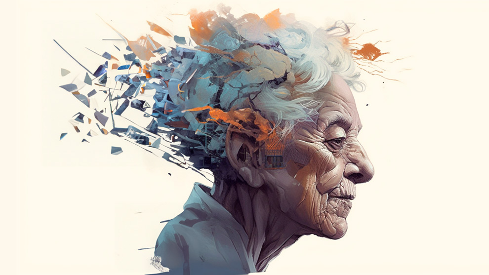

# Alzheimer: A prediction tool for doctors

## Summary
This projects aims to provide a healthcare tool for doctors, which, given several input, assists them into a diagnosis for Alzheimer's Disease. This is done with two separate Machine Learning models, to ensure evidence-based decisions on the matter.

This project is made for educational purposes and depends partially on synthetic databases. Discretion using its insights is advised, and no real diagnosis must be done without a specialized healthcare worker.

### Preliminary model
A first model is based on a preliminary diagnosis of the patient. The input is made of several form responses and states of the patient, such as Mini-Mental State Examination, a Functional Assessment Form, a perceived alteration of their daily life by the own patient, and whether they present memory complaints or sudden behavioral problems.

The model indicates whether the patient presents signs of Alzheimer, or not.

### MRI Model
If the preliminary model perceives signs of Alzheimer, or is unsure about the diagnosis, a second model can be applied. This second ML model uses a Convolutional Neural Network, that bases its perediction on a MRI Scan of the patient's brain. The CNN gives one out of four options:
- Brain shows no signs of Alzheimer.
- Brain shows signs of Alzheimer. It then gives three other options, based on the advancement of the disease:
    - Very Mild.
    - Mild.
    - Moderate.

## Main resources and how to use them
- **Streamlit**: An app where a non-technical user can utilize the models. It contains a form in whose results the prediction will be based upon. It can be accessed via [this link](https://ai-lzh.streamlit.app)

If for any reason the application is not running, you can execute it manually. Go to the folder *app_streamlit* and run the following code:

`streamlit run app.py`

You will need to have Streamlit Instaled on your local computer, along with the libraries marked on **Requirements.txt**

- In general, all the libraries included on **Requirements.txt** are needed to open and replicate the project. This file is both founded on the root folder, and inside *app_streamlit*.

- **Presentations**, which are located on *docs/Presentations*. Two presentations here:
    - The technical one is prepared for a public with knowledge on Data Science. It focuses on the process of Data Analysis, Model Fitting and Predictions, and the different iterations made throughout the project.
    - A presentation that simulates a explanation for a business public, who may not be interested in the technical issues of the project. It focuses on the added value that the project provides for healthcare workers.

- **Work journals**, which can be found on the folder *notebooks*. Here the EDAs and the model training and predictions' code can be found. 

## Sources of data
Two main sources of data are used for the project:

-The preliminary model uses **[this source from Kaggle](https://www.kaggle.com/datasets/rabieelkharoua/alzheimers-disease-dataset/data)**. It is a synthetic database, so proceed with caution with the insights extracted from this model.

-The MRI model is trained with **[this source, also from Kaggle](https://www.kaggle.com/datasets/rabieelkharoua/alzheimers-disease-dataset/data)**.
